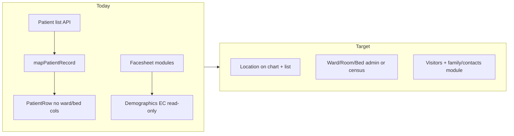

# Plan: Bed/Ward/Room + Visitor & Family (SOW §3.1)

## Current codebase snapshot

- **Ward/bed data exists in the list model but not in the table UI.** `[PatientListItem](e:\Inpatient-EMR-Application\src\services\patient.service.ts)` includes `ward` and `bed` with API mapping; sort fields support `ward` / `bed`, but `[PatientTable](e:\Inpatient-EMR-Application\src\components\patients\PatientTable.tsx)` / `[PatientRow](e:\Inpatient-EMR-Application\src\components\patients\PatientRow.tsx)` do not show or sort by them.
- **Room HTTP helpers exist but are unused in UI.** `[appointmentAPI.getRoomList](e:\Inpatient-EMR-Application\src\services\api.ts)` (`/Rooms/getRoomList`) and `getRooms` are defined; no callers found in `src`.
- **No ADT or bed-board routes**; facesheet modules (`[facesheetModules.ts](e:\Inpatient-EMR-Application\src\facesheet\facesheetModules.ts)`) have no location, ADT, visitor, or contacts entries.
- **Emergency contact** appears read-only in `[Demographic.tsx](e:\Inpatient-EMR-Application\src\pages\patient\Demographic.tsx)` from demographics API; **no visitor model, routes, or facesheet module**. `[FamilyMembers.tsx](e:\Inpatient-EMR-Application\src\pages\family\FamilyMembers.tsx)` is subscription/MRN-link oriented, **not routed** for clinical use.

---

## A. Bed / Ward / Room Management

**Goal:** Staff can maintain and see **facility structure** (ward → room → bed) and **patient placement** in line with inpatient workflows; prepare for ADT if/when APIs exist.

1. **Backend contract alignment (blocking)**
  - Confirm with the API team: shape of `/Rooms/getRoomList`, whether **ward/unit** and **bed** are separate masters, and how **current location** is returned on `getPatientById` / facesheet payloads.  
  - If ADT endpoints exist (admit/transfer/discharge), document paths and payloads; if not, scope **display + manual assignment** only until ADT is available.
2. **Types and services**
  - Add a small `rooms.service.ts` (or extend `[api.ts](e:\Inpatient-EMR-Application\src\services\api.ts)` with typed wrappers) for room/ward/bed list and any **assign bed** / **transfer** mutations the backend provides.  
  - Extend **facesheet patient** mapping in `[facesheetSlice.ts](e:\Inpatient-EMR-Application\src\store\facesheetSlice.ts)` / related types so **ward/room/bed** appear on the banner or a dedicated panel when the API returns them (reuse `raw` if needed for a first pass).
3. **Patient list visibility**
  - Add **Ward** and **Bed** columns (and optional sort controls) to `[PatientTable.tsx](e:\Inpatient-EMR-Application\src\components\patients\PatientTable.tsx)` / `[PatientRow.tsx](e:\Inpatient-EMR-Application\src\components\patients\PatientRow.tsx)` using existing `PatientListItem` fields—low risk, immediate value.
4. **Management UI (choose depth based on API)**
  - **Minimum:** New facesheet sub-route e.g. `location` or `placement` under `[FacesheetPage](e:\Inpatient-EMR-Application\src\pages\facesheet\FacesheetPage.tsx)` + entry in `[FACESHEET_MODULES](e:\Inpatient-EMR-Application\src\facesheet\facesheetModules.ts)`: show current location, dropdowns fed from room/ward APIs, save via backend.  
  - **If master-data CRUD exists:** Admin-style page under app layout (e.g. `/app/facility/beds`) for units/rooms/beds; otherwise read-only directory + “assign patient” only.
5. **Compliance / RBAC**
  - Gate placement/edit actions with existing auth patterns (reuse role checks used elsewhere on facesheet).  
  - Ensure **audit logging** is required on the backend for placement changes; frontend passes user context as other modules do.

**Note:** SOW also lists **Live Bed Board** separately; this plan focuses on **management** (master data + assignment + visibility). A **census grid** can reuse the same services in a follow-on task.

---

## B. Visitor & Basic Family Management

**Goal:** On the inpatient chart, staff can record **visitors** (who, when, relationship, optional restrictions) and **basic family / contacts** (multiple contacts, next-of-kin, guardian) beyond a single emergency contact—without conflating with subscription `[FamilyMembers](e:\Inpatient-EMR-Application\src\pages\family\FamilyMembers.tsx)`.

1. **Backend contract**
  - Define or consume endpoints such as: `GET/POST/PUT/DELETE` for **visitors** (encounter-scoped or date-scoped) and **patient contacts** (persistent). If the backend only supports one emergency contact, agree on **extension fields** or a **contacts** array before UI work.
2. **Facesheet module**
  - Add `visitors` or `contacts` to `[FACESHEET_MODULES](e:\Inpatient-EMR-Application\src\facesheet\facesheetModules.ts)` and nested route in `[FacesheetPage](e:\Inpatient-EMR-Application\src\pages\facesheet\FacesheetPage.tsx)`.  
  - UI sections: **Active visitors / today’s log**, **Scheduled visits** (optional), **Family & contacts** (table + add/edit with validation), link to **isolation / visitor policy** flags if infection data exists later.
3. **State**
  - Prefer **React Query or local fetch** per module (consistent with `[Demographic.tsx](e:\Inpatient-EMR-Application\src\pages\patient\Demographic.tsx)`) unless you need global cache—then extend Redux similarly to `[facesheetSlice](e:\Inpatient-EMR-Application\src\store\facesheetSlice.ts)` only if multiple screens must stay in sync.
4. **RBAC & HIPAA**
  - Restrict add/edit to appropriate roles (e.g. nursing, registration); read-only for others if required.  
  - Visitor logs are PHI-adjacent; ensure lists are **encounter/patient scoped** and **audit** on create/update.
5. **Demographics integration**
  - Optionally surface a **summary** (“NOK: …”) on `[Demographic](e:\Inpatient-EMR-Application\src\pages\patient\Demographic.tsx)` that deep-links to the new module, or keep demographics as-is and avoid duplication if the new API becomes the source of truth for contacts.

---

## Suggested delivery order (about five milestones)

1. API confirmation + types/services for rooms and contacts/visitors.
2. Patient list ward/bed columns + facesheet location display.
3. Facesheet **Location / placement** module (assign/transfer as API allows).
4. Facesheet **Visitors & family** module (CRUD + list).
5. RBAC hardening, QA scenarios (California inpatient + HIPAA audit expectations), UAT with client SME.

---

## Assumptions & risks

- **Backend readiness** drives whether “management” is full CRUD or read-only + single assignment.  
- **Live Bed Board** is out of this slice unless you explicitly merge it here.  
- **HL7/FHIR ADT** is Phase B in your SOW; frontend can stay REST-first and swap transport later.

