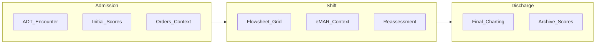
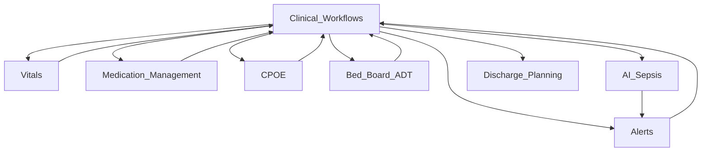
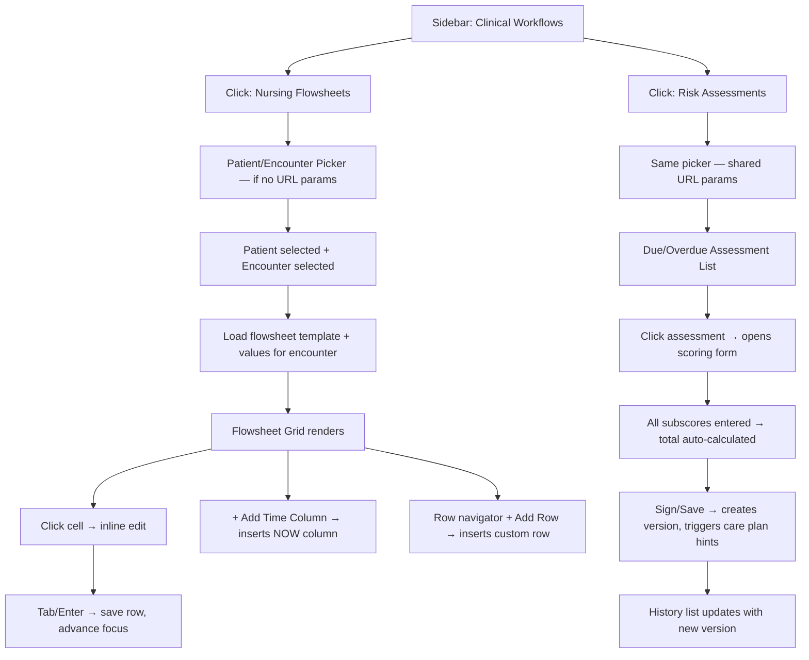
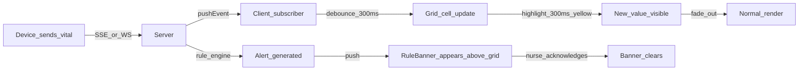

# Clinical Workflows — Enterprise Product, Workflow, Architecture & UX Specification

**Product context:** US-style inpatient EMR (EpicCare / Cerner Millennium class). **New module:** **Clinical Workflows** under **Patients**, alongside Patient List, Bed Board, Clinical Documentation, Discharge & Billing, Medication Management.

**Sidebar target (enterprise hierarchy):**

```
Patients
├── Patient List
├── Bed Board
├── Clinical Workflows          → /app/inpatient/clinical
│   ├── Nursing Flowsheets      → …/clinical/flowsheets
│   └── Risk Assessments        → …/clinical/risk-assessments
├── Clinical Documentation      → (narrative hub; separate from flowsheets)
├── Discharge & Billing
└── Medication Management
```

Optional third child **Clinical workspace** (chart, notes, vitals, CPOE shell) if your product keeps physician/nursing tabs in the same hub until Clinical Documentation is split out.

---

## 1. What is the Clinical Workflows module?

**Definition:** An **encounter-scoped operational workspace** for **high-frequency, time-stamped structured nursing observations** (flowsheets) and **policy-driven standardized assessments** (risk instruments), with **cross-module context** (vitals, orders, bed, alerts), **audit-grade provenance**, and hooks for **rules and AI**.

It is the **shift operations console**—not a one-off form and not primarily narrative clinical reasoning.

---

## 2. Why it is critical

| Driver | Operational impact |
|--------|---------------------|
| **Patient safety** | Deterioration, falls, pressure injury, suicide risk depend on timely, consistent structured data. |
| **Accreditation (TJC/CMS)** | Auditors expect evidence of **reassessment**, **pain follow-up**, **fall/skin programs**, documentation timeliness. |
| **Throughput / staffing** | Poor grid UX increases charting minutes per patient and **off-unit time**; omissions drive callbacks and harm. |
| **Downstream** | Quality measures, CDI, and some operational reporting consume flowsheet and score data. |

---

## 3. Clinical Documentation vs Nursing Flowsheets vs Risk Assessments

| Dimension | Clinical Documentation | Nursing Flowsheets | Risk Assessments |
|-----------|------------------------|------------------|------------------|
| **Intent** | Narrative + reasoning (H&P, progress, consult) | **Repeated structured observations over time** | **Scored instruments** with defined frequency |
| **Structure** | Documents / notes | **Sparse matrix:** rows = measures, columns = time (or transpose) | **Versioned forms** + calculated total + tier |
| **Primary authors** | Physicians, APPs; nursing notes overlap | **RNs** (+ delegated tech rows where policy allows) | **RNs** (psych tools per policy) |
| **Regulatory story** | “What we thought and did” | **“What we measured and when”** | **“We screened and mitigated”** |
| **UX paradigm** | Rich text, templates, macros | **Spreadsheet / timeline + device ingest** | **Wizard / structured form** + due/overdue queue |

---

## 4. Primary hospital staff

| Role | Flowsheets | Risk assessments |
|------|------------|------------------|
| **Bedside RN** | Primary entry | Primary |
| **Charge / house** | Exception queues, coverage | Escalation, overdue worklists |
| **PCA/UAP** | Vitals, I/O where delegated | Rarely |
| **RT / PT / OT** | Specialty rows (O₂, mobility) | Collaborative (falls, mobility) |
| **Attending / hospitalist** | Read trends | Triggered orders from scores |
| **Pharmacist** | Adjacent (med-linked rows) | Indirect |

---

## 5. Real-world nurse workflow (admission → discharge)

1. **Admission:** Verify identity/location → admission vitals → **initial risk screens** (falls, skin, pain, suicide per unit policy) → awareness of orders and isolation → **flowsheet template** for unit/service line opens.
2. **Shift:** Q1–Q4 vitals per policy; I/O; lines/devices; PRN follow-up; **reassess on change** (procedure, transfusion, transfer, new O₂).
3. **Handover:** Shift-bounded view + “last documented” gaps + SBAR artifact (module or linked).
4. **Discharge:** Final vitals/teaching; risk instances **closed/archived** with timestamps.



---

## 6. Epic / Cerner–style structuring (conceptual)

- **Epic:** Template-bound **flowsheet rows**; **performed vs recorded** time; **SmartData/BPAs** on abnormal values; **LDA** (lines/devices) adjacent to grid.
- **Cerner:** **PowerForms/Flowsheets** task/result model; **IView** longitudinal; **Discern Rules** for clinical events.

**Your product should mirror:** template-driven rows, **strong cell typing**, **performed/recorded**, **versioned assessments**, **server-side rule hooks**.

---

## 7. Module connections



---

## 8. Automatic data sync (recommended)

| Source → Target | Data |
|-----------------|------|
| ADT / Bed Board → CW | Unit, room, bed, isolation, service |
| Vitals (device/manual) → Flowsheet | Values + **performed** time |
| eMAR → Flowsheet | Optional read-only mirror (given times) |
| Flowsheet / scores → Alerts | Thresholds, NEWS-style composites, missing reassessment |
| Risk scores → Orders / care plans | Fall bundle, surfaces, sitter consult (governed) |
| Risk scores → Discharge | Mobility/skin barriers |
| CPOE → Flowsheet | Required monitoring rows when high-risk meds active |

**Principle:** **Encounter_id** as join key; append-only observations where possible; **idempotent** device writes.

---

## 9. Recommended frontend architecture

- **Feature slices:** `clinical-workflows/flowsheets`, `…/risk-assessments`, `…/shared` (hooks, types, RBAC).
- **Server state:** TanStack Query; **WS/SSE** optional per encounter channel.
- **Grid:** Virtualize rows (and optionally columns); **frozen** label column + sticky time header.
- **RBAC:** Row-level and action-level (delegate entry vs RN-only rows).
- **Offline carts:** Queued writes with explicit pending state (later phase).

---

## 10. Angular module/component structure (and React equivalent)

| Angular (enterprise) | This codebase (React + Vite + RR6) |
|----------------------|-------------------------------------|
| `ClinicalWorkflowsModule` + lazy `Routes` | Lazy `RouteObject` + **layout route** + `<Outlet />` |
| Smart/container + dumb/presentational | Page containers + `components/` |
| NgRx feature | Redux + React Query (prefer Query for server cache) |
| Resolvers | `loader` or layout `useEffect` + shared `useEncounterSearchParams` |

**Suggested routes:** `/clinical`, `/clinical/flowsheets`, `/clinical/risk-assessments`, optional `/clinical/workspace`.

---

## 11. Sidebar + routing (summary)

- Parent **Clinical Workflows** expands to **Nursing Flowsheets** and **Risk Assessments**; preserve `?patientId=&encounterId=` across child navigation.
- **Index redirect** on parent to default child (workspace or flowsheets per product decision).

---

## 12. Page-level architecture

- **Flowsheets:** Left row navigator (search, favorites, LDA) | Center **grid/timeline** | Right **context** (sparklines, active orders snippet).
- **Modes:** Current shift (default), date range history, read-only print snapshot.
- **Risk:** **Due / overdue** queue + in-progress drafts + signed history with version compare.

---

## 13. Sticky patient header (requirements)

- Name, MRN, DOB/age, sex, **allergies** (high visibility), isolation, room/bed, LOS, attending, short problem list, **last fall/braden/pain** icons with due.
- Actions: **Change patient** (safe URL reset), Print, Help.
- Sticky below app header; compact on narrow viewports.

---

## 14. Real-time monitoring

- Subscribe on encounter; **debounce** device bursts; highlight **new time column** since last view.
- **Concurrency:** Avoid naive last-write-wins; prefer **server arbitration** or short-lived cell locks + audit.

---

## 15. Shift-based charting

- Store **performed** in facility TZ; display per user preference.
- Filters: “my shift”, last 8h/24h; configurable shift boundaries.
- **Gaps:** Visual striation + manager/quality reports for missing documentation windows.

---

## 16. Timeline/grid flowsheet UX

- Default: **time on X**, **rows on Y**; optional transpose.
- Hour bands + **now** indicator; keyboard grid navigation (←/→, Enter commit, F2 edit).
- Row types: numeric, enum, boolean, short text, **derived read-only**, **device** badge.
- **Empty vs refused vs N/A** must be visually and semantically distinct.

---

## 17. Risk assessment instruments

| Tool | Use | Output |
|------|-----|--------|
| **Morse Fall** | Med/surg, ortho | Score + precaution level |
| **Braden** | PI prevention | Score + surface/intervention hints |
| **Pain** (numeric/FLACC) | Universal | Score + reassessment loop post-intervention |
| **GCS** | Neuro/ICU/ED | Subscores + total |
| **Suicide (e.g. Columbia)** | ED/psych per policy | Tier + monitoring / environment |

Each: **definition version**, effective dates, mandatory fields, draft handling, **reassessment schedule** and **on transfer/change in condition**.

---

## 18. Alerts from abnormal charting

- **Server-evaluated** thresholds on write (vitals, UOP, pupils).
- Composite scores (NEWS/MEWS) when you add them.
- **Documentation gaps** (e.g. Braden overdue): nudge vs hard stop per governance.
- Surfaces: in-banner, task list, future paging bridge.

---

## 19. AI opportunities

| Use | Inputs | Output |
|-----|--------|--------|
| **Sepsis suspicion** | Vitals, labs, lactate, abx | Tier + short explainability |
| **Deterioration** | Trends, I/O, scores | Early warning |
| **Readmission** | Comorbidities, utilization, SDOH if available | Risk + discharge levers |

**Governance:** Human-in-the-loop; log **model version** and feature snapshot for audit.

---

## 20. HIPAA audit logging

Log: user, role, patient_id, encounter_id, **action** (view/create/amend/delete), entity type, **before/after** on amend, IP/device/session id, **UTC timestamp**. Separate **break-glass** stream if used.

---

## 21. CMS / Joint Commission

Demonstrate timely reassessment, **pain reassessment after intervention**, fall and pressure injury program elements, suicide environmental screening where applicable. This module is where **process compliance** is visible—not only in progress notes.

---

## 22. Enterprise UX principles

Density and speed over decoration; forgiving flows (confirm destructive structured edits); **WCAG 2.1 AA**; **never color alone** for critical states.

---

## 23. Why flowsheets are not normal forms

Forms are often **one-off document** interactions. Flowsheets are **time-series instrumentation**: sparse matrices, bulk patterns, integrations—closer to **operational telemetry** than a PDF.

---

## 24. Spreadsheet-style EMR UX

Frozen row labels; sticky headers; cautious multi-select with confirmation; explicit units (°C/°F); inline validation tooltips.

---

## 25. Keyboard-first nurses

Predictable tab order; F2 edit; Ctrl+S save row; shortcuts for “add now column”; macros only with role + audit.

---

## 26. Color system (semantic)

| Level | Use |
|-------|-----|
| **Critical** | Life-threatening — red family + **icon + text** |
| **Warning** | Policy/threshold — amber |
| **Normal** | In range — neutral (optional subtle positive border) |

---

## 27. Recommended API shape

- `GET /encounters/{id}/flowsheet-template`
- `GET /encounters/{id}/flowsheet-values?from=&to=`
- `PATCH /flowsheet-values` (batch)
- `GET/POST /encounters/{id}/risk-assessments` (definition_key, version, answers, score, status)
- `POST /encounters/{id}/clinical-events/evaluate-rules`

---

## 28. Database entities (core)

`encounter`, `flowsheet_template`, `flowsheet_template_row`, `flowsheet_value` (performed_at, recorded_at, value_json, source_device_id, entered_by), `risk_assessment_definition`, `risk_assessment_instance`, `clinical_alert`, `audit_event`, optional `flowsheet_cell_lock`.

---

## 29. Reusable frontend components

`PatientEncounterHeader`, `FlowsheetGrid`, `TimeColumnHeader`, `VitalSparkline`, `RiskScoreCard`, `DueAssessmentList`, `StructuredNumericInput`, `RefusalReasonSelect`, `TrendPanel`, `RuleBanner`.

---

## 30. Future scalability (ICU, Neuro, Oncology, Telemetry)

**Template packs** per specialty/unit; feature flags per facility; row plugins (CAM-ICU, neuro pupils, chemo toxicity); partition/archive flowsheet values by time for performance.

---

## 31. Risks of poor EMR design

Missed deterioration, shadow documentation, alert fatigue, wrong-patient errors (weak header), delayed discharge, burnout.

---

## 32. Junior FE mistakes in EMR

No virtualization on large grids; PHI in `localStorage`; missing performed vs recorded; no amend audit; weak RBAC on rows; “marketing UI” density that slows nurses.

---

## 33–35. Layout & visual hierarchy (1920-first)

- **Stack:** App bar (~56px) → sticky patient header (~64–72px) → **240px** row rail + **≥960px** grid + **320px** context rail (collapsible).
- **Responsive:** Collapse right rail first, then left rail to drawer; **minimum 12px** body for clinical data.
- **Hierarchy:** Patient identity + alerts first; time window second; chrome third—weight and spacing over loud color blocks.

---

## 36. Future roadmap

I/O rows; wound (with secure images); neuro checks bundle; **shift handover** with sign-off; care plan links (NANDA/NIC/NOC optional); **unit sepsis dashboard**.

---

**Implementation alignment (this repo):** React + Vite; split monolithic [`ClinicalWorkflowsPage.tsx`](e:/Inpatient-EMR-Application/src/pages/inpatient/ClinicalWorkflowsPage.tsx) into **layout + child routes**; extend [`features/clinical-workflows/`](e:/Inpatient-EMR-Application/src/features/clinical-workflows/); update [`Sidebar.tsx`](e:/Inpatient-EMR-Application/src/components/Layouts/Sidebar.tsx) and [`router/index.tsx`](e:/Inpatient-EMR-Application/src/router/index.tsx) for nested clinical routes.

---

# Clinical Workflows — Complete Enterprise UI/UX Design Specification

---

## UX-1. Enterprise Sidebar Hierarchy

```
┌─────────────────────────────┐
│  ● EMR Inpatient             │
├─────────────────────────────┤
│  ⬜ Dashboard                │
│  ⬜ Appointments             │
│                             │
│  ▼ Patients                 │  ← accordion, always open in inpatient
│    ├─ Patient List          │
│    ├─ Bed Board             │
│    ├─ ▼ Clinical Workflows  │  ← NEW parent, expands on click
│    │    ├─ Nursing Flowsheets│  ← /clinical/flowsheets
│    │    └─ Risk Assessments │  ← /clinical/risk-assessments
│    ├─ Clinical Documentation│
│    ├─ Discharge & Billing   │
│    └─ Medication Mgmt       │
│                             │
│  ⬜ Settings                │
└─────────────────────────────┘
```

**Sidebar behavior rules:**
- "Clinical Workflows" is a **toggle button** (not a NavLink). Clicking it expands/collapses its children. It does NOT navigate.
- The active child (`Nursing Flowsheets` or `Risk Assessments`) gets an **active highlight** (left border accent + bold).
- On mobile (<1024px), the sidebar slides in as a drawer and closes after any link click.
- The sidebar is **200px wide** on desktop; collapsible to icon-only (48px) rail — not required for v1 but plan for it.
- When a sub-route is active, the **parent "Clinical Workflows"** node stays expanded and shows the chevron pointing down.

---

## UX-2. Full Page Wireframe — Nursing Flowsheets (1920×1080 Desktop)

```
┌─────────────────────────────────────────────────────────────────────────────────────────────────┐
│ APP HEADER (56px)  — Logo | Breadcrumb: Patients > Clinical Workflows > Nursing Flowsheets       │
│                             Actions: [Refresh] [Print] [Help]        User: RN Jane Doe ▾        │
├─────────┬───────────────────────────────────────────────────────────────────┬───────────────────┤
│ SIDEBAR │  STICKY PATIENT HEADER (64px)                                     │  RIGHT CONTEXT    │
│  200px  │  John Smith · MRN 100432 · M/58y · Rm 4B-12 · LOS 3d             │  PANEL  (320px)   │
│         │  ⚠ NKDA  |  Isolation: None  |  Attending: Dr. Patel             │  (collapsible)    │
│         │  Code: Full  | Admit: 05/10 09:22  | DRG: Pneumonia              │                   │
│         │  [Fall: 35 ↑ HIGH — due now] [Braden: 18 OK — 8h] [Pain: 6/10]  │                   │
├─────────┼───────────────────────────────────────────────────────────────────┤                   │
│         │  SUB-NAV TABS (40px)                                              │  ┌─────────────┐  │
│  Sidebar│  [Nursing Flowsheets ●] [Risk Assessments] [Clinical Workspace]  │  │ VITALS      │  │
│  (left) │                                                                   │  │ SPARKLINES  │  │
│         ├──────────────────────┬────────────────────────────────────────────┤  │ HR  ──/\──  │  │
│         │  ROW NAVIGATOR       │  FLOWSHEET GRID (main area, scrollable X) │  │ BP  ─/\─── │  │
│         │  (240px, scrollY)    │                                            │  │ SpO2 ────── │  │
│         │                      │  FROZEN ▸  │ 08:00 │ 09:00 │ 10:00 │ NOW │  │             │  │
│         │  [🔍 Search rows…]   │  ──────────┼───────┼───────┼───────┼─────│  ├─────────────┤  │
│         │                      │  ▼ VITALS  │       │       │       │     │  │ ACTIVE      │  │
│         │  ▼ VITALS            │  HR (bpm)  │  88   │  92   │  90●  │[___]│  │ ORDERS      │  │
│         │    HR                │  BP mmHg   │120/78 │118/76 │  —    │[___]│  │ heparin drip│  │
│         │    BP                │  Temp °C   │  37.1 │  —    │  37.3 │[___]│  │ NS 125/h    │  │
│         │    Temp              │  SpO2 %    │  98   │  97   │  98   │[___]│  │             │  │
│         │    SpO2              │  RR (/min) │  16   │  —    │  18   │[___]│  ├─────────────┤  │
│         │    RR                │  ──────────┼───────┼───────┼───────┼─────│  │ ACTIVE      │  │
│         │                      │  ▼ NEURO   │  (collapsed — click to expand)│  │ PROBLEMS    │  │
│         │  ▼ I/O               │  ──────────┼───────┼───────┼───────┼─────│  │ Pneumonia   │  │
│         │    UOP mL/h          │  ▼ I/O     │       │       │       │     │  │ HTN         │  │
│         │    Intake Total      │  UOP mL/h  │  55   │  60   │  58   │[___]│  │ DM Type 2   │  │
│         │                      │  PO Intake │  —    │  200  │  —    │[___]│  │             │  │
│         │  ▼ LINES/DEVICES     │  IV Intake │  125  │  125  │  125  │[___]│  ├─────────────┤  │
│         │    PIV #1 (20g RA)   │  ──────────┼───────┼───────┼───────┼─────│  │ OVERDUE     │  │
│         │                      │  ▼ LINES   │                             │  │ TASKS       │  │
│         │  ▼ SKIN/WOUND        │  PIV site  │  intact│  —   │  intact│[___]│  │ 🔴 Fall Scr │  │
│         │                      │  ──────────┴───────┴───────┴───────┴─────│  │ 🟠 Pain ReA │  │
│         │  [+ Add Row…]        │                                            │  │ ✅ Braden   │  │
│         │                      │  [+ Add Time Column]    [Copy Previous]   │  └─────────────┘  │
├─────────┴──────────────────────┴────────────────────────────────────────────┴───────────────────┤
│ STATUS BAR: Shift: Morning 07:00–19:00  |  Last saved: 10:42  |  ⚡ Live  |  RN: J. Doe        │
└─────────────────────────────────────────────────────────────────────────────────────────────────┘
```

**Key spatial rules:**
- Total 3-panel layout. Left rail (240px) + Center grid (fluid, min 960px) + Right panel (320px, collapsible to 48px icon rail).
- App header and sticky patient header never scroll away. Everything below scrolls independently.
- Grid scrolls **horizontally** (time axis) AND **vertically** (rows) independently. The frozen label column stays fixed.
- Row navigator scrolls **vertically** only, independent of the grid.

---

## UX-3. Complete User Navigation Flow



**Encounter switching:** The patient/encounter pickers live in the sticky layout header. Changing patient resets encounter. Changing encounter reloads grid or risk list in place. No page reload. URL params (`?patientId=&encounterId=`) update so the URL is shareable/bookmarkable.

---

## UX-4. Screen-by-Screen Breakdown

### Screen A — No Encounter Selected (Landing / Empty State)

```
┌──────────────────────────────────────────────────┐
│  Clinical Workflows                              │
│  ─────────────────────────────────────────────  │
│  Select a patient and active encounter to begin  │
│                                                  │
│  [Patient ▾ ────────────────]  [Encounter ▾ ──] │
│                                                  │
│  ── Or scan patient wristband ──                │
│                                                  │
│  Recent: John Smith · 4B-12 · Enc #7731  [Open] │
│          Maria G.   · 3A-08 · Enc #7698  [Open] │
└──────────────────────────────────────────────────┘
```

- Show **recent encounters** the nurse previously opened (session-scoped, no PHI persistence).
- "Scan wristband" placeholder reserved for barcode integration.

---

### Screen B — Nursing Flowsheets (Encounter Active)

Already shown in UX-2. Key interaction detail:

| Zone | Behavior |
|------|----------|
| Sticky header | Always visible. Shows critical alerts inline (red badge). Change patient button visible. |
| Row navigator | Searchable tree. Group collapse/expand per section. Starred/favorited rows float to top. |
| Grid | Virtualized. Frozen label column (240px). Horizontal scroll for time. Cells inline-editable. |
| Cell states | Blank = uncharted. Value = documented. `R` badge = Refused. `N/A` badge = Not applicable. `⚡` = device-sourced (read-only). |
| Right panel | Collapsible. Default: Vitals sparklines + Active orders + Overdue tasks. |

---

### Screen C — Risk Assessments (Encounter Active)

```
┌──────────────────────────────────────────────────────────────────────────────┐
│  STICKY PATIENT HEADER (same as flowsheets)                                 │
│  [Nursing Flowsheets] [Risk Assessments ●] [Clinical Workspace]             │
├──────────────────┬───────────────────────────────────────┬───────────────────┤
│  ASSESSMENT LIST │  ASSESSMENT DETAIL / FORM             │  HISTORY PANEL    │
│  (280px)         │  (fluid)                              │  (280px)          │
│                  │                                       │                   │
│  DUE / OVERDUE   │  Morse Fall Scale                     │  Versions         │
│  ─────────────── │  ─────────────────────────────────── │  ─────────────── │
│  🔴 Morse Fall   │  History of falling: [Yes] [No]       │  05/13 10:00 RN  │
│     OVERDUE 2h   │  Secondary diagnosis: [Yes] [No]      │  Score: 35 HIGH  │
│  🟠 Braden       │  Ambulatory aid: [None▾]              │                   │
│     Due in 6h    │  IV/Heparin lock: [Yes] [No]          │  05/12 08:00 RN  │
│  ✅ Pain         │  Gait: [Normal▾]                      │  Score: 25 MED   │
│     Done 08:30   │  Mental status: [Oriented▾]           │                   │
│  ✅ GCS          │                                       │  05/11 18:00 RN  │
│     Done 06:00   │  ─────────────────────────────────── │  Score: 20 LOW   │
│                  │  TOTAL SCORE:  35                     │                   │
│  SCHEDULED       │  LEVEL:  ⚠ HIGH FALL RISK            │  [Compare ▾]      │
│  ─────────────── │                                       │                   │
│  Columbia (psych)│  Care plan suggestion:                │                   │
│  Per policy      │  → Non-slip footwear                  │                   │
│                  │  → Bed alarm activated                │                   │
│  [+ Manual]      │  → Call light in reach                │                   │
│                  │                                       │                   │
│                  │  [Save Draft]  [Sign & Complete]      │                   │
└──────────────────┴───────────────────────────────────────┴───────────────────┘
```

---

## UX-5. Nursing Workflow: Admission → Shift Charting → Discharge

```
ADMISSION (Nurse arrives, patient placed in bed)
│
├─ Open Nursing Flowsheets → select patient/encounter
├─ System opens unit-default template (Vitals, I/O, Lines)
├─ [+ Add Time Column] → columns for 08:00 generated
├─ Enter admission vitals in first column
│
├─ Navigate to Risk Assessments
├─ System shows: ⚠ 4 assessments due at admission
│    → Morse Fall (required)   → Braden (required)
│    → Pain (required)         → Suicide screen (if psych flag)
├─ Complete each: subscores → total auto-calculated → Sign
│
SHIFT CHARTING (Q2h–Q4h per unit policy)
│
├─ Nursing Flowsheets: click [+ Add Time Column] or [NOW]
├─ Tab through: HR → BP → Temp → SpO2 → RR → UOP
├─ F2 on any cell = open inline editor
├─ Enter/Tab = commit and move focus right/down
├─ Right panel shows overdue tasks inline
├─ If vital abnormal → server evaluates → RuleBanner appears
│    "⚠ HR 112 — tachycardia threshold exceeded"
│
├─ Risk reassessment on change in condition:
│    → Transfer → Braden and Morse re-required
│    → Post-procedure → Pain reassessment required within 30 min
│    → Overdue tasks appear as 🔴 in right panel + row navigator badge
│
HANDOVER (End of shift)
│
├─ Shift filter → "Morning shift" → shows all documented columns
├─ Right panel: gaps (uncharted hours) highlighted in amber
├─ SBAR artifact: open in Clinical Workspace tab, fill situation/background/assessment/recommendation
├─ Sign handover → next nurse sees "accepted" in their task list
│
DISCHARGE
│
├─ Final vitals column → chart all required
├─ Risk assessments: mark final scores → closed/archived
├─ Teaching checklist (in Discharge & Billing module) reviewed
├─ Flowsheet grid moves to read-only/archived state
```

---

## UX-6. Sticky Patient Header — Detailed Design

```
┌─────────────────────────────────────────────────────────────────────────────────────┐
│ John Smith · MRN 100432 · M · 58y · Rm 4B-12 · Bed A · LOS: 3d 4h                │
│ Attending: Dr. Patel · Service: Med/Surg · Pneumonia (J18.9)                       │
│ ⛔ NKDA  |  Isolation: None  |  Code: Full Code  |  Admit: 05/10 09:22            │
│ [Fall: 35 HIGH ↑ — ⏰ OVERDUE]  [Braden: 18 OK — Due 16:00]  [Pain: 6/10]        │
│                                          [Change Patient ⇄]  [🖨 Print]  [? Help]  │
└─────────────────────────────────────────────────────────────────────────────────────┘
```

**Rules:**
- **Always sticky** below the app header. Never scrolls away.
- On viewports < 1280px it compresses to a single compact bar showing only Name + Room + 2 score badges.
- "Change Patient" safely clears encounter ID from URL params (triggers confirmation if unsaved cells exist).
- Allergies always shown — red if documented, gray "NKDA" if none.
- Score badges: color-coded (see UX-22 color system). Badge shows last score, level, and next due time.
- Clicking a score badge deep-links to that assessment in Risk Assessments.

---

## UX-7. Left Row Navigator — Detailed Structure

```
┌───────────────────────────┐
│ 🔍 Search rows…           │
├───────────────────────────┤
│ ★ FAVORITES               │
│   HR (bpm)               │
│   BP (mmHg)              │
├───────────────────────────┤
│ ▼ VITAL SIGNS             │
│   ● HR (bpm)         [⚡] │  ← ⚡ = device-sourced
│   ● BP (mmHg)            │
│   ● Temp (°C)            │
│   ● SpO2 (%)         [⚡] │
│   ● RR (/min)            │
│   ● Weight (kg)          │
├───────────────────────────┤
│ ▶ NEUROLOGICAL     [2 ↓]  │  ← collapsed, badge = 2 uncharted
├───────────────────────────┤
│ ▼ INTAKE/OUTPUT           │
│   ● UOP (mL/h)       [!] │  ← [!] = uncharted this hour
│   ● PO Intake            │
│   ● IV Total             │
│   ● Output Total         │
├───────────────────────────┤
│ ▶ LINES/DEVICES           │
├───────────────────────────┤
│ ▶ SKIN/WOUND              │
├───────────────────────────┤
│ [+ Add Custom Row…]       │
└───────────────────────────┘
```

**Behavior:**
- Sections are collapsible with chevron.
- Badge `[2 ↓]` = uncharted items count within that group for the current shift.
- `[!]` = this specific row has a gap for the current hour.
- Star icon on hover = add to Favorites.
- Search filters row labels in real time.
- Clicking a row label scrolls the grid to that row (row focus sync).

---

## UX-8. Main Flowsheet Grid — Detailed Structure

```
FROZEN LABEL COL (240px)                 SCROLLABLE TIME COLUMNS →
┌──────────────────────────┬────────┬────────┬────────┬────────┬──────────────┐
│ Vital Signs              │ 08:00  │ 09:00  │ 10:00  │ 11:00  │ [+NOW 11:42] │
│ performed ─────────────► │ 08:05  │ 09:10  │ 10:02  │        │              │
├──────────────────────────┼────────┼────────┼────────┼────────┼──────────────┤
│ HR (bpm)             ⚡  │   88   │   92   │   90   │        │    [  ___  ] │
│ BP (mmHg)               │120/78  │118/76  │        │        │    [  / __ ] │
│ Temp (°C)               │  37.1  │        │  37.3  │        │    [  ___ ] │
│ SpO2 (%)             ⚡  │   98   │   97   │   98   │        │    [  ___  ] │
│ RR (/min)               │   16   │        │   18   │        │    [  ___  ] │
├──────────────────────────┼────────┼────────┼────────┼────────┼──────────────┤
│ I/O                      │        │        │        │        │              │
│ UOP (mL/h)              │   55   │   60   │   58   │  ⏰ !! │    [  ___  ] │
│ PO Intake (mL)          │        │  200   │        │        │    [  ___  ] │
│ IV Intake (mL/h)        │  125   │  125   │  125   │  125   │    [  ___  ] │
└──────────────────────────┴────────┴────────┴────────┴────────┴──────────────┘
                                                        ↑
                                          ⏰ = overdue / expected but missing
```

**Column header behavior:**
- Top row = **scheduled time** (the policy/ordered time).
- Second row (smaller) = **performed time** (when actually charted).
- Difference > 15 min shows in amber. Difference > 60 min shows in red.
- `[+NOW 11:42]` button always floats at the right edge to add the current time.
- "NOW line" = a vertical blue line between the last documented column and the current time.

**Cell behavior on click:**
1. Cell enters **inline edit mode** — border highlights, input appears.
2. `Enter` or `Tab` commits value and moves focus to next cell.
3. `Escape` cancels.
4. Right-click menu (or long-press): `Mark Refused` | `Mark N/A` | `Copy from previous` | `View history`.
5. After save: server evaluates threshold rules. If abnormal, a `RuleBanner` appears above the grid.

**Sparse data rendering:**
- `—` = blank (uncharted, no expectation).
- `⏰` = expected (per policy frequency) but missing.
- `R` badge (amber) = Refused.
- `N/A` badge (gray) = Not applicable (charted as not applicable by nurse).
- `⚡` icon (blue) = Device-sourced (read-only; device integration value).

---

## UX-9. Right Contextual Panel — Detailed Structure

```
┌─────────────────────────┐
│ [Vitals] [Orders] [More]│  ← tab strip
├─────────────────────────┤
│ VITALS SPARKLINES        │
│ HR  ─/\──/\─── 90 bpm  │
│ BP  ─────/──── 118/76   │
│ SpO2 ───────── 98%      │
│ [View full chart ▸]     │
├─────────────────────────┤
│ ACTIVE ORDERS            │
│ • Heparin 5000u q8h     │
│ • NS 125mL/h            │
│ • Metoprolol 25mg PO    │
│ [All orders ▸]          │
├─────────────────────────┤
│ OVERDUE TASKS            │
│ 🔴 Morse Fall — 2h OD  │  ← click → jumps to Risk Assessments
│ 🟠 Pain reassess 10:00 │
│ [All tasks ▸]           │
├─────────────────────────┤
│ ACTIVE PROBLEMS          │
│ • Pneumonia (J18.9)     │
│ • HTN (I10)             │
│ • DM Type 2 (E11)       │
└─────────────────────────┘
```

- Panel is **collapsible** — clicking the `»` rail collapses to 48px with icons only.
- "View full chart" opens a modal overlay with the full vitals trend chart (Chart.js line).
- Overdue task rows are **clickable** — navigate to the relevant screen preserving encounter context.

---

## UX-10. Risk Assessment Workflow (Detailed)

```
STEP 1: Nurse sees Due/Overdue List
  [Morse Fall Scale]  ⏰ OVERDUE (2h 15min)   [Start ▶]
  [Braden Scale]      Due in 6h               [Start ▶]
  [Pain Assessment]   ✅ Done 08:30  Score 6  [View / Re-assess]
  [GCS]               ✅ Done 06:00  Score 15 [View / Re-assess]

STEP 2: Click [Start ▶] on Morse Fall Scale
  → Right panel collapses
  → Assessment form opens in main area
  → Each question = structured input (radio / select)
  → Running total updates live as subscores change
  → Required fields highlighted if left blank on save attempt

STEP 3: Sign & Complete
  → [Save Draft] — saves partial, keeps in "in-progress" queue
  → [Sign & Complete] — final, creates immutable version, timestamps
  → Care plan hints appear (non-blocking): "Consider bed alarm, non-slip footwear"
  → System evaluates: if score crosses threshold → triggers clinical alert

STEP 4: History panel updates
  → New version appears at top of history list
  → Previous versions accessible (read-only)
  → [Compare ▾] shows side-by-side diff of subscore changes
```

---

## UX-11. Flowsheet Interaction Model (Epic/Cerner-Style)

| Action | Behavior |
|--------|----------|
| Click cell | Inline edit (no modal, no navigation) |
| Tab | Commit + move right |
| Enter | Commit + move down |
| Shift+Tab | Move left |
| F2 | Open cell editor explicitly |
| Ctrl+S | Save entire current row |
| Escape | Cancel edit |
| Right-click cell | Context menu: Refused / N/A / Copy Prev / History |
| Click row label | Expand/collapse row section |
| Click time header | Sort / go to that time column |
| Ctrl+→ | Jump to NOW column |
| Double-click time header | Edit performed time |

**Why this is NOT a normal form:** Each cell is an independent, time-stamped observation. There is no single "submit" for the whole grid. The grid is a continuous, sparse time-series — more like a spreadsheet tied to a clinical policy engine than a form submission. Rows are templates, not fields. Columns are dynamically generated based on shift and policy frequency.

---

## UX-12. Real-Time Update Flow



- Device values appear in grid cells with a **yellow flash** (300ms) then settle.
- Device cells have `⚡` badge — nurse cannot edit them.
- Multiple rapid device updates are **debounced** (300ms) so the grid does not flicker.
- If backend is unreachable, grid shows a `⚡ Offline — changes will sync when connection restores` status bar warning.

---

## UX-13. Alert Escalation Flow

```
LEVEL 1 — Nudge (amber, dismissible banner above grid):
  "⚠ Braden reassessment overdue by 2 hours"
  [Dismiss] [Go to Assessment ▸]

LEVEL 2 — Warning (amber persistent, also in right panel overdue list):
  "⚠ HR 112 bpm — exceeds tachycardia threshold (100)"
  Cannot dismiss; must acknowledge.
  [Acknowledge + Comment]

LEVEL 3 — Critical (red banner, modal on first breach):
  "🔴 SpO2 dropped to 84% — immediate action required"
  Blocks interaction until acknowledged.
  Auto-notifies charge nurse via task list.
  [Acknowledge & Document Intervention ▸]

ALERT FATIGUE PREVENTION:
  - Suppress duplicate alerts < 30 min apart (configurable).
  - "Snooze 1h" option for Level 1 nudges only.
  - Charge nurse sees aggregate alert count, not individual pop-ups.
  - Quiet hours for documentation gap nudges (configurable by unit manager).
```

---

## UX-14. Mobile / Responsive Behavior

| Breakpoint | Layout |
|------------|--------|
| ≥1920px | All 3 panels visible. Grid max columns shown. |
| 1280–1919px | Right panel visible but narrower (260px). Grid scrolls normally. |
| 1024–1279px | Right panel collapses to icon rail. Left row nav still visible. |
| 768–1023px | Left row nav becomes slide-over drawer. Flowsheet grid full-width with horizontal scroll. |
| < 768px | Full single-column. Sticky header compact. Grid uses simplified 2-column view (label + current). |

Mobile is **not** the primary use case. Nurses primarily use 15–24" clinical workstation monitors or COW (Computer on Wheels). Tablet support is secondary (COW tablet mode).

---

## UX-15. Enterprise Spacing and Density

- **Base font:** 13px (clinical data), 12px (metadata), 11px (timestamps, labels). Never below 11px.
- **Row height:** 32px (normal) / 28px (compact mode toggle).
- **Column width:** 80px minimum for time columns. Scalable to 100px for legibility.
- **Cell padding:** 4px vertical, 8px horizontal.
- **Section header height:** 28px (bold, uppercase, 11px).
- **No decorative whitespace** — every pixel carries information.
- **Grid lines:** 1px solid `border-gray-200 dark:border-gray-700`. Subtler than most apps. Nurse eyes scan horizontally, not border-first.

---

## UX-16. Visual Hierarchy Strategy

```
Priority 1 (always in viewport): Patient identity + active critical alerts
Priority 2 (top of work area):   Current shift time columns + overdue indicators
Priority 3 (primary work):       Grid cells + row labels + inline values
Priority 4 (contextual):         Right panel sparklines and orders
Priority 5 (chrome):             App header, navigation, settings
```

Rule: **Weight and position carry hierarchy, not color blocks.** Use `font-semibold` for patient name, `font-medium` for row labels, `font-normal` for cell values. Color only for semantic state (critical/warning/overdue/normal).

---

## UX-17. Role-Based Workflow Differences

| Feature | Bedside RN | Charge Nurse | Physician / APP |
|---------|-----------|--------------|-----------------|
| Flowsheet entry | Full write | Read + override | Read-only |
| Risk assessments | Full write | View aggregate | Read-only + order triggers |
| Add time column | Yes | Yes | No |
| Device rows | Read-only (all) | Read-only (all) | Read-only (all) |
| Delete/amend cell | Own entries only | Any entry in unit | None |
| Right panel | Standard | Adds: unit-wide overdue queue | Adds: trend chart focus |
| Alert acknowledgment | Own patient | Any in unit | Clinical alerts only |
| SBAR handover | Author | Countersign | View |

---

## UX-18. 1920px Hospital Desktop Layout — Exact Pixel Plan

```
Total width: 1920px
├── Sidebar: 200px (fixed left)
└── Main area: 1720px
    ├── Row navigator: 240px (fixed left of grid)
    ├── Flowsheet grid: 1160px (fluid, scrollable X)
    └── Right panel: 320px (fixed right, collapsible)

Total height: 1080px
├── App header: 56px
├── Sticky patient header: 72px
├── Sub-nav tabs: 40px
├── Work area: 888px (scrolls independently)
└── Status bar: 24px
```

The grid work area of **888px × 1160px** on a 1920px monitor gives nurses approximately **12–14 time columns** simultaneously visible at 80px column width — equivalent to a full morning shift without horizontal scrolling.

---

## UX-19. Grid Virtualization Strategy

- Virtualize **rows** using `@tanstack/react-virtual` (`useVirtualizer`). Only render rows within the visible vertical viewport + 5-row overscan buffer.
- For columns: at typical shift scale (24 columns per day), virtualization is optional. Implement if > 48 columns (multi-day or ICU dense mode).
- Frozen label column is a **separate DOM subtree** (`position: sticky; left: 0`) with matching row heights using shared `rowHeight` context.
- Grid scrollable container has `overflow-x: auto; overflow-y: auto`. Row heights sync via a shared height array from the virtualizer.
- Row **group headers** (Vitals, I/O, etc.) are non-virtualized — always rendered, act as anchor rows.

---

## UX-20. Timeline / Hour-Column Behavior

- Time columns represent **performed hours** (not documented hours). The header shows both.
- **Hour bands:** Group by 2h in default view. Full-day view groups by 4h. ICU mode: 1h granularity.
- **Shift boundary line:** Thick vertical line separating morning / evening / night columns.
- **Now indicator:** Animated blue dashed vertical line to the right of the last documented column.
- `[+ Add Time Column]` always visible at right edge of grid header. Clicking inserts current timestamp as a new column. Nurse can edit the time if the actual charting time differs from NOW.
- Columns can be **sorted** (ascending/descending time). Default: ascending (left = oldest, right = newest).

---

## UX-21. Shift-Based Charting Logic

```
Shift definition (configurable):
  Morning:  07:00 – 19:00
  Night:    19:00 – 07:00

Shift filter in grid:
  [All time] [Morning shift ●] [Night shift] [Last 8h] [Last 24h] [Custom range ▾]

Shift view:
  - Only shows time columns within the selected shift.
  - Uncharted gap rows are highlighted if policy expects Q2h documentation.
  - "My shift" auto-selects based on login time and shift configuration.

Gap detection:
  - For each row with a frequency policy (e.g., HR q2h):
    - If time since last value > frequency interval → row shows ⏰ in that expected column.
    - Right panel "Overdue Tasks" lists all such gaps.
    - Charge nurse sees aggregate count per patient.

Copy-forward:
  - "Copy from previous hour" (right-click menu or keyboard shortcut).
  - Copies numeric value only; marks the new cell as "copied" (gray italic).
  - Only allowed for stable chronic values (weight, tube size). NOT for vitals.
  - Requires role guard + audit log entry.
```

---

## UX-22. Color System (Semantic, Accessible)

| Semantic State | Background | Border | Text | Icon |
|----------------|------------|--------|------|------|
| **Critical** | `red-50 dark:red-950/40` | `red-400` | `red-900 dark:red-100` | ⛔ |
| **Warning** | `amber-50 dark:amber-950/40` | `amber-400` | `amber-900 dark:amber-100` | ⚠ |
| **Overdue** | `orange-50 dark:orange-950/40` | `orange-400` | `orange-900 dark:orange-100` | ⏰ |
| **Completed / Normal** | `transparent` | `green-300` (subtle) | `gray-900 dark:gray-100` | ✅ |
| **In progress / Draft** | `blue-50 dark:blue-950/30` | `blue-300` | `blue-900 dark:blue-100` | ✏ |
| **Device-sourced** | `transparent` | none | `gray-600` | ⚡ |
| **Refused** | `amber-100` | `amber-300` | `amber-800` | R |
| **Not applicable** | `gray-100 dark:gray-800` | none | `gray-400` | N/A |

**Accessibility rule:** Color is **never the sole indicator** of state. Always pair with icon + text label. All critical/warning states also use `font-semibold`.

---

## UX-23. Best Grid/Table Practices for Hospital Software

1. **Never paginate flowsheets.** Nurses need to scroll through the full shift. Pagination breaks clinical continuity.
2. **Frozen row labels** — always visible regardless of horizontal scroll.
3. **Sticky time header** — always visible regardless of vertical scroll.
4. **Minimum touch target** 32px for mobile/tablet cells.
5. **Inline edit only** — no modal dialogs for cell entry. Modals break flow for 12h shift charting.
6. **Single-click to edit**, not double-click. Speed matters.
7. **Visible unsaved state** — cells with pending saves show a subtle amber outline.
8. **Auto-save on focus loss** — nurse moves to next cell, previous cell auto-saves.
9. **Undo window** — 10-second undo bar after auto-save (toast-style).
10. **Row height density** — 32px default; nurses toggle compact (28px) for high-acuity patients with many rows.

---

## UX-24. Enterprise Interaction Patterns

- **No confirmation dialogs for routine entry.** Only destructive actions (delete, amend signed note) require confirmation.
- **Optimistic UI.** Cell value updates immediately in the grid; server confirmation happens in background. On failure, the cell reverts with a red indicator.
- **Batch save** on row level (all cells in one row saved on Tab-past-last-cell).
- **Context menus** (right-click) replace modals for secondary actions (refused, N/A, copy, history).
- **Keyboard shortcuts documented** in a `?` help overlay (Ctrl+/ opens it). Nurses use shortcuts after day 3.
- **Error inline.** Validation errors appear as a red tooltip below the cell, not a page-level banner.

---

## UX-25. Empty / Loading / Error States

| State | Presentation |
|-------|-------------|
| **No patient selected** | Centered picker with recent encounters. No blank white page. |
| **Loading encounter data** | Skeleton rows in the grid (same height as real rows). Not a spinner blocking the whole screen. |
| **Loading vitals** | Sparklines show placeholder lines (gray animated shimmer). |
| **No data for shift** | Grid shows row labels + empty cells + `[+ Add Time Column]` prompt in center. |
| **Error fetching** | Inline red banner above grid: "Could not load flowsheet data — [Retry]". Grid still renders structure. |
| **Save failed** | Cell reverts. Amber tooltip: "Save failed — [Retry]". Toast in top-right. |
| **Assessment overdue** | Row in list shows ⏰ OVERDUE badge + time elapsed. Not hidden. |

---

## UX-26. Smart UX for Overdue Charting

- **Proactive nudge:** 15 min before a documentation is due, the row label in the navigator shows a subtle amber dot.
- **At overdue:** Row label turns orange, right panel overdue list adds the item with elapsed time.
- **2h+ overdue:** Row label turns red. Patient header score badge also shows red. Charge nurse task list notified.
- **Clicking overdue item** in the right panel jumps directly to that row in the grid (smooth scroll + row highlight) or to the assessment form — without any extra navigation steps.
- **"Chart all overdue"** button appears in right panel when ≥3 items are overdue — opens a compact wizard to quickly fill each one in sequence.

---

## UX-27. Alert Fatigue Prevention

| Strategy | Implementation |
|----------|---------------|
| De-duplication | Suppress same alert type < 30min window |
| Tiered severity | Only Level 3 (critical) blocks interaction |
| Snooze | Level 1 nudges snooze 1h; logged in audit |
| Quiet period | Documentation gap nudges suppressible 22:00–06:00 |
| Charge view | Aggregate count per patient, not individual pop-ups |
| Acknowledged trails | Once acknowledged, alert moves to history — does not repeat unless re-triggered |
| Max concurrent banners | Max 2 RuleBanners above grid; additional overflow to right panel queue |

---

## UX-28. AI-Assisted Workflow Opportunities

| Feature | Where it appears | UX pattern |
|---------|-----------------|------------|
| Sepsis early warning | Right panel — replaces "Active Problems" tab with "AI Monitor" tab when risk ≥ moderate | Non-blocking amber tile: "Sepsis risk: Moderate — 3 SIRS criteria met. [View ▸]" |
| Deterioration trend | Sparkline panel — overlay on vitals trend | Trend line changes to orange/red color with "⬇ Trending" label |
| Missed documentation AI | Row navigator | Rows with likely-needed values highlighted by AI with a `💡` hint |
| Pain reassessment reminder | Right panel, post-intervention | "💡 Pain PRN given at 09:45 — reassessment recommended by 10:15" |
| Auto-population | Device rows | Device-sourced rows pre-fill with `⚡` badge; nurse one-click confirms |

**Governance:** All AI suggestions are non-blocking, clearly labeled as AI-generated (`🤖`), and carry an explanation link. Nurse always controls final entry.

---

## UX-29. Recommended Reusable Frontend Components

| Component | Purpose |
|-----------|---------|
| `PatientEncounterHeader` | Sticky header shared across all inpatient modules |
| `FlowsheetGrid` | Virtualized grid with frozen column + sticky time header |
| `FlowsheetCell` | Individual cell with edit mode, refused/N/A, device badge |
| `TimeColumnHeader` | Scheduled + performed times; shift boundary lines |
| `RowNavigator` | Searchable, collapsible row tree with badges |
| `VitalSparkline` | Mini trend chart for right panel |
| `RiskScoreCard` | Score + level badge + due time; clickable |
| `DueAssessmentList` | Overdue queue list for risk assessments |
| `RiskAssessmentForm` | Subscore wizard with live total calculation |
| `RuleBanner` | Dismissible/critical alert banner above grid |
| `OverdueTaskPanel` | Right panel overdue task list with deep-link |
| `ShiftFilterBar` | Shift/time range selector |
| `StructuredNumericInput` | Clinical input: min/max validation, unit display |
| `RefusalReasonSelect` | Dropdown for refused/N/A with required reason |
| `AuditTrailTooltip` | On hover over cell: shows who charted, when, from what device |
| `AIMonitorTile` | Non-blocking AI risk widget for right panel |

---

## UX-30. Future Scalability

| Unit type | Additions |
|-----------|-----------|
| **ICU** | 1h column granularity; CAM-ICU row group; ventilator settings rows; CRRT I/O; 1:1/1:2 nurse assignment; hourly gap detection |
| **Oncology** | Chemo toxicity grid (CTCAE rows); infusion timing rows; transfusion reaction monitoring section |
| **Neuro** | Pupils row (L/R size + reactivity); NIH Stroke Scale; GCS already in Risk but added as flowsheet row for frequency monitoring |
| **Telemetry** | Heart rhythm row (enum: NSR / AF / VT / …); remote monitoring integration badge; 12-lead event log |

All units use the **same grid engine with different template packs** loaded per unit/service. No separate codebase. Template packs are configurable by facility administrators in Settings.

---

## UX-31. Exact Screen Layout — ASCII Diagrams

### Risk Assessment Landing (encounter selected)

```
┌──────────────────────────────────────────────────────────────────────────────────┐
│ APP HEADER                                                                       │
├──────────────────────────────────────────────────────────────────────────────────┤
│ STICKY PATIENT HEADER                                                            │
├──────────────────────────────────────────────────────────────────────────────────┤
│ [Nursing Flowsheets] [Risk Assessments ●] [Clinical Workspace]                  │
├──────────────┬─────────────────────────────────┬──────────────────────────────┤
│ DUE LIST     │ ACTIVE ASSESSMENT FORM           │ HISTORY                      │
│              │                                  │                              │
│ 🔴 Morse    │ Morse Fall Scale                 │ Version 3  05/13 10:00  RN  │
│   OVERDUE   │ ─────────────────────────────── │ Score: 35  HIGH  ↑           │
│             │ 1. History of falling?  [Yes ●]  │                              │
│ 🟠 Braden  │ 2. Secondary diagnosis? [No  ●]  │ Version 2  05/12 08:00  RN  │
│   Due 16:00 │ 3. Ambulatory aid:      [None▾]  │ Score: 25  MED               │
│             │ 4. IV/Heparin lock:     [Yes ●]  │                              │
│ ✅ Pain    │ 5. Gait:                [Weak ▾] │ Version 1  05/11 18:00  RN  │
│   Done 08:30│ 6. Mental status:       [Alert▾] │ Score: 20  LOW               │
│             │                                  │                              │
│ ✅ GCS     │ TOTAL: 35  ⚠ HIGH FALL RISK      │ [Compare versions ▾]         │
│   Done 06:00│                                  │                              │
│             │ Suggested: Bed alarm, non-slip   │                              │
│ [+ Manual]  │ [Save Draft]   [Sign & Complete] │                              │
└──────────────┴─────────────────────────────────┴──────────────────────────────┘
```

---

## UX-32. Click Flow Examples

### Click: Patient name in Patient List → opens Clinical Workflows

```
Patient List row click (encounter active)
  → URL: /app/inpatient/clinical/flowsheets?patientId=X&encounterId=Y
  → Layout mounts patient header
  → Flowsheet grid loads template + values
  → Row navigator populates
  → Right panel loads vitals sparklines
  → Overdue tasks computed and shown
```

### Click: Overdue task in right panel

```
Right panel: "🔴 Morse Fall — OVERDUE 2h" clicked
  → If on Flowsheets page → subnav switches to Risk Assessments
  → Due list auto-selects "Morse Fall Scale"
  → Assessment form opens in center panel
  → Focus placed on first subscore input
  → Keyboard ready: Tab → Tab → Tab to complete all subscores
```

### Click: Flowsheet cell (e.g., HR cell at 11:00 column)

```
Cell click → cell enters edit mode (blue outline, input appears)
  → Previous value pre-filled (editable)
  → Tab → commits value → server saves → focus moves right
  → If value out-of-range → amber tooltip below cell
  → Server evaluates rule → if breaches threshold →
       RuleBanner appears: "⚠ HR 112 — tachycardia threshold exceeded"
  → Nurse acknowledges banner → banner moves to history in right panel
```

### Click: Risk score badge in patient header (e.g., "Fall: 35 HIGH")

```
Badge click → URL: /app/inpatient/clinical/risk-assessments?patientId=X&encounterId=Y&focus=morse-fall
  → Risk Assessments page opens
  → "Morse Fall Scale" is auto-selected in due list
  → Most recent version shown in history panel
  → [Re-assess] button highlighted
```

---

## UX-33. How Epic/Cerner Flowsheet Systems Work Internally (Conceptual)

Epic and Cerner both use a **template-driven, sparse-value model**:

| Concept | Description |
|---------|-------------|
| **Template** | A definition of which rows (measures) appear, their type, units, validation, and display order. Templates are bound to department/service/episode type. |
| **Row** | A named measure (e.g., "Heart Rate") with a type (numeric, enum, boolean, text), unit, and frequency policy. |
| **Value** | A single data point: row_id + encounter_id + performed_at + recorded_at + value + entered_by + source. It is **append-only** — edits create a new version, not an update-in-place. |
| **Performed vs Recorded** | Performed = when the measurement was taken (e.g., 09:45). Recorded = when it was entered into the system (e.g., 10:02). Both are stored and auditable. |
| **Rules engine** | After each value write, a server-side rule engine evaluates thresholds. Results are clinical alerts or BestPractice Advisories (BPAs). |
| **Cell lock** | Prevents two nurses editing the same cell simultaneously. Epic uses an optimistic model with conflict resolution. |
| **Copy-forward** | Allowed only for stable values, with explicit audit trail. |
| **Device integration** | HL7 feeds or proprietary ADT/device protocols push values directly. These appear with a device badge and are not editable by nurses. |

Your product should replicate this model. The grid is the **UI skin** over a time-series observations store.

---

## UX-34. Why This Module Must NOT Be a Normal Form Page

| Normal form | Flowsheet |
|-------------|-----------|
| One submission per visit | Dozens of entries per shift, per row |
| Linear field-by-field flow | Non-linear: nurse jumps between rows and times |
| Single author at a time | Multiple nurses may chart same encounter simultaneously |
| Data makes sense at submission | Data is meaningful at cell level — per row, per timestamp |
| Fields have one value | Each "field" (row) has N time-stamped values |
| Validation on submit | Validation at cell level, in real time |
| No concept of "overdue" | Policy-driven frequency means overdue is a core UX state |
| Audit trail is incidental | Audit trail is **regulatory requirement** per value |

Building this as a form (like a patient intake screen) would result in: duplicate data entry, inability to trend, broken compliance evidence, and nurse workarounds (shadow paper charts).

---

## UX-35. React + Vite + Tailwind Specific Recommendations

| Concern | Recommendation |
|---------|---------------|
| **Grid rendering** | `@tanstack/react-virtual` for row virtualization. Do not use a third-party data grid library — clinical grids need full control over cell behavior. |
| **State** | TanStack Query for server state (already installed). Local grid edit state in `useReducer` per-encounter context, not Redux (too chatty for cell-level state). |
| **Tailwind density** | Use `text-[13px]` and `p-[4px_8px]` utilities for clinical density. Do not use default Tailwind `p-4` or `text-sm` — too spacious. |
| **Sticky frozen column** | CSS `position: sticky; left: 0; z-index: 10` on the label `<td>`. Match heights between label column and grid column via shared row height array from virtualizer. |
| **Color tokens** | Define semantic CSS variables (`--color-critical`, `--color-warning`, `--color-overdue`) in `tailwind.css` so dark mode works correctly — do not hardcode colors in components. |
| **Keyboard nav** | Build a `useCellNavigation` hook that manages a `focusedCell: { rowIdx, colIdx }` state and handles arrow keys, Tab, Enter, F2, Escape natively. Wire to `onKeyDown` on the grid container. |
| **Cell edit** | Controlled input inside the cell `<td>`. On focus: show input. On blur: auto-save. Do not use a separate editing modal. |
| **Sparklines** | Use Chart.js `Line` with `tension: 0.25`, no legend, no axes labels — just the trend line for right panel sparklines. Already installed. |
| **Right-click context menu** | `onContextMenu` handler on cells. Render a `Portal`-based dropdown positioned at mouse coordinates. Dismiss on click-outside or `Escape`. |
| **PrimeNG note** | This repo is React, not Angular. PrimeNG patterns (e.g., PrimeReact DataTable) are **not recommended** for the flowsheet grid — they do not support frozen columns + virtualization well at this density. Use the custom `FlowsheetGrid` component pattern described above. |
