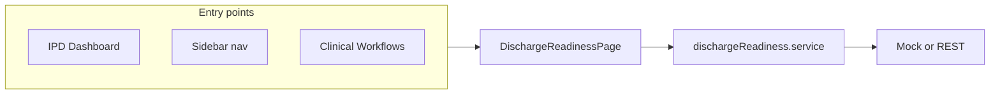

# Discharge & Billing Readiness — Implementation Plan

## Context (current codebase)

- IPD bed board lives on [src/pages/Dashboard.tsx](src/pages/Dashboard.tsx); rows carry `encounterId` and `patientId` ([src/types/ipdDashboard.ts](src/types/ipdDashboard.ts)). Discharge today is a single confirm + [postEncounterDischarge](src/services/ipdDashboard.service.ts) — no readiness gates.
- Inpatient clinical work uses encounter selection and role-aware tabs in [src/pages/inpatient/ClinicalWorkflowsPage.tsx](src/pages/inpatient/ClinicalWorkflowsPage.tsx) ([clinicalRole](src/features/clinical-workflows/clinicalRole.ts), [adt.service](src/services/adt.service.ts) for `listActiveEncounters`).
- New routes are registered in [src/router/routes.tsx](src/router/routes.tsx); primary nav in [src/components/Layouts/Sidebar.tsx](src/components/Layouts/Sidebar.tsx).

## Target UX (single “hub” page)

One **encounter-scoped** page (query: `?encounterId=` or route param) with:

1. **Sticky readiness header** — separate indicators: **Clinical discharge** vs **Bill ready**; list blockers with owner hint (Physician / Nursing / Billing / Registration).
2. **Tabs** (match your BRD, keep layout consistent with existing `panel` / `btn` classes):
   - **Discharge summary** — sections (admission reason, hospital course, procedures, final Dx, disposition, condition, DC meds, follow-up); states draft / signed; primary action Sign (physician-only if you reuse `canSignPhysicianNote` or a dedicated flag).
   - **Nursing checklist** — task rows with completed + notes; optional “blocks discharge” flag per task.
   - **Charges** — category tabs or filters (R&B, Lab, Rx, etc.); line grid with status `pending_capture | posted | hold`; manual add entry point (billing-oriented).
   - **Eligibility** — run check, normalized 271 summary + **history table**; show “stale” if last check older than configurable threshold.
   - **Billing / claim prep** — claim summary strip, diagnosis/procedure confirmation strip, status (pending / submitted / denied / paid), placeholder for ERA (no real 837 in v1 unless backend exists).

**Role-based visibility**: Reuse [normalizeRoles](src/features/clinical-workflows/clinicalRole.ts) / Redux auth the same way [ClinicalWorkflowsPage](src/pages/inpatient/ClinicalWorkflowsPage.tsx) does — tabs or actions disabled with tooltip when not allowed (avoid duplicating a second RBAC system).

## Data layer (frontend-first, API-shaped)

Add **[src/types/dischargeReadiness.ts](src/types/dischargeReadiness.ts)** — TypeScript models for:

- `ReadinessGate` (id, category: clinical | operational | financial, severity: hard | soft, message, resolved, ownerRole).
- `DischargeSummaryState` (version, sections, signedAt, signedBy).
- `ChecklistTask`, `ChargeLine`, `EligibilityCheck`, `ClaimPrepSnapshot` (status + totals + line pointers).

Add **[src/services/dischargeReadiness.service.ts](src/services/dischargeReadiness.service.ts)**:

- `getReadiness(encounterId)` — aggregate gates + tab payloads (or split endpoints later).
- Mutations: `saveSummaryDraft`, `signSummary`, `updateChecklist`, `addCharge`, `updateCharge`, `runEligibility`, `setBillingHold`, `finalizeClaimPrep` (names can match your REST doc).
- **Phase 1**: implement with **mock data** + `Promise` delays; structure responses so swapping to `api` from [src/services/api.ts](src/services/api.ts) is a thin change.
- **Phase 2**: point to real `/api/encounters/:id/...` when backend is ready; keep normalization helpers (same style as [ipdDashboard.service.ts](src/services/ipdDashboard.service.ts)).

## Routing and navigation

- Register a lazy route, e.g. **`/app/inpatient/discharge-readiness`** (optional `encounterId` query), in [src/router/routes.tsx](src/router/routes.tsx).
- Add **Sidebar** link under “EMR Inpatient” next to Clinical Workflows in [src/components/Layouts/Sidebar.tsx](src/components/Layouts/Sidebar.tsx).
- **Dashboard**: when a row has `encounterId`, add a secondary action **“Discharge & billing”** (link to hub with query) in [src/pages/Dashboard.tsx](src/pages/Dashboard.tsx) or [IpdPatientDetailsPanel](src/components/ipd/IpdPatientDetailsPanel.tsx) — keeps workflow discoverable without replacing the existing quick “Discharge Patient” button.
- **Clinical Workflows**: optional link/button “Open discharge readiness” for the selected encounter (same query URL) to reduce context switching.

## Component breakdown (suggested paths)

Under `src/components/ipd/discharge/` (or `src/components/discharge/` if you prefer non-IPD prefix):

- `DischargeReadinessHeader.tsx` — gates + badges.
- `DischargeSummaryTab.tsx`, `NursingChecklistTab.tsx`, `ChargeCaptureTab.tsx`, `EligibilityTab.tsx`, `ClaimPrepTab.tsx`.
- Shared: `GateList.tsx`, `EncounterPickerBanner.tsx` (when no `encounterId`, prompt user to pick from `listActiveEncounters` like Clinical Workflows).

Page shell: **`src/pages/inpatient/DischargeReadinessPage.tsx`** — loads encounter from query, fetches readiness, handles loading/error toasts (reuse `react-hot-toast` / `sonner` per existing pages).

## Behavior rules (v1 — configurable later)

- **Hard block** display when gates include unresolved `hard` severity (e.g. unsigned summary, failed eligibility with org policy, missing principal Dx on claim prep).
- **Soft block** — warning banner only; still allow saves.
- Do **not** wire `postEncounterDischarge` to hard-block in v1 unless product asks: show a **warning** on Dashboard discharge if readiness gates fail (optional follow-up).

## Optional facesheet integration (later slice)

- Add a `discharge-readiness` route under [FacesheetPage](src/pages/facesheet/FacesheetPage.tsx) only if you can resolve **inpatient encounter id** from facesheet context; otherwise defer to avoid wrong encounter scope.

## Testing / quality

- Manual: open hub from Dashboard with a row that has `encounterId`; tab through roles (if test users exist).
- If the project has ESLint/TS strict paths, run `tsc`/lint on touched files after implementation.

## Out of scope for initial delivery

- Real X12 270/271 translation, 837I generation, DRG grouper — UI placeholders and typed fields only.
- Server-side audit trail — frontend sends actions; logging is backend concern.
